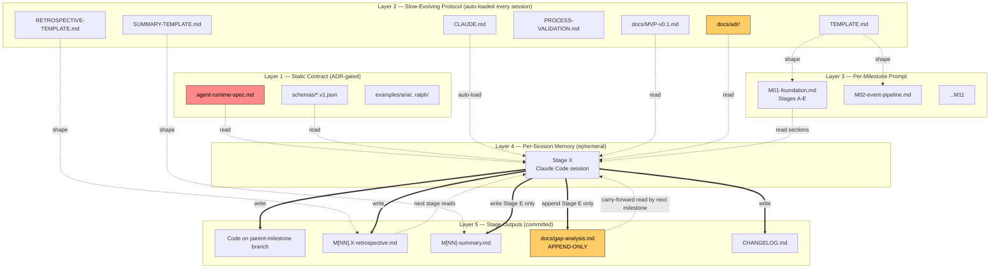

# Persistence Architecture — How Memory and Instructions Flow Across the Build

> **Purpose.** This is the high-level architecture of how the project's documents, retrospectives, and protocols persist and flow across Claude sessions, stages, and milestones. Use it to answer: *"Where does this information live? Who reads it? Who writes it? When does it become immutable?"*

---

## 1. The four persistence layers

```
┌─────────────────────────────────────────────────────────────────────┐
│  LAYER 1 — STATIC CONTRACT          (changes via ADR only)          │
│  • agent-runtime-spec.md             (what we're building)          │
│  • schemas/*.v1.json                 (source-of-truth types)        │
│  • examples/aria/, examples/ralph/   (archetype proofs)             │
│  • LICENSE, NOTICE                                                  │
└─────────────────────────────────────────────────────────────────────┘
                              ▲
                              │ (rarely edited; ADR required)
┌─────────────────────────────────────────────────────────────────────┐
│  LAYER 2 — SLOW-EVOLVING PROTOCOL   (auto-loaded every session)     │
│  • CLAUDE.md                         (Hard Rules, gates, workflow)  │
│  • docs/MVP-v0.1.md                  (milestone scope)              │
│  • docs/build-prompts/TEMPLATE.md    (per-milestone shape)          │
│  • docs/build-prompts/PROCESS-VALIDATION.md                         │
│  • docs/build-prompts/retrospectives/                               │
│      RETROSPECTIVE-TEMPLATE.md       (per-stage shape)              │
│      SUMMARY-TEMPLATE.md             (per-milestone shape)          │
│  • docs/adr/                         (immutable once accepted)      │
└─────────────────────────────────────────────────────────────────────┘
                              ▲
                              │ (per-milestone authoring)
┌─────────────────────────────────────────────────────────────────────┐
│  LAYER 3 — PER-MILESTONE PROMPT     (one document per parent M[NN]) │
│  • docs/build-prompts/M[NN]-<title>.md                              │
│      Header (background, design decisions, scope)                   │
│      Stages A → B → C → D → E (each X.1 ... X.6)                    │
│      Summary table + verification checklist                         │
└─────────────────────────────────────────────────────────────────────┘
                              ▲
                              │ (one fresh session per stage; cleared between)
┌─────────────────────────────────────────────────────────────────────┐
│  LAYER 4 — PER-SESSION MEMORY       (ephemeral; bounded by stage)   │
│  • The Claude Code session's context window                         │
│  • Files read at session start (Layer 1+2+3 + prior retros)         │
│  • Live retrospective tables filled as friction surfaces            │
│  • Code being written, gates being run                              │
└─────────────────────────────────────────────────────────────────────┘
                              │
                              │ (writes back to Layer 5 at session end)
                              ▼
┌─────────────────────────────────────────────────────────────────────┐
│  LAYER 5 — STAGE OUTPUTS            (committed; some immutable)     │
│  • Code commits on the parent-milestone feature branch              │
│  • docs/build-prompts/retrospectives/M[NN].<X>-retrospective.md     │
│  • docs/build-prompts/retrospectives/M[NN]-summary.md (Stage E)     │
│  • docs/gap-analysis.md  (APPEND-ONLY; per CLAUDE.md §20)           │
│  • CHANGELOG.md updates                                             │
└─────────────────────────────────────────────────────────────────────┘
```

**Key property:** every layer below reads from layers above. Layer 1+2 load on every session; Layer 3 loads when the milestone starts; Layer 4 is the working memory for one stage; Layer 5 is what survives the stage and feeds the next.

---

## 2. Stage lifecycle — what one stage reads, writes, surfaces

```
                    ┌───────────────────────────────┐
                    │     STAGE X SESSION OPENS     │
                    │  (fresh context; branch:      │
                    │   claude/m[nn]-<title>)       │
                    └──────────────┬────────────────┘
                                   │
                                   ▼
              ┌────────────────────────────────────────────┐
              │  READ (in order)                           │
              │  1. CLAUDE.md                  (auto)      │
              │  2. M[NN]-<title>.md  X.1–X.4              │
              │  3. agent-runtime-spec.md (sections cited) │
              │  4. ADRs (cited)                           │
              │  5. PRIOR-STAGE RETROSPECTIVES (X≥B)       │
              │     [END] Decisions for the next stage     │
              │     [LIVE] friction events (carry-forward) │
              │  6. docs/gap-analysis.md Carry-forward     │
              │     items targeting THIS stage             │
              └──────────────┬─────────────────────────────┘
                             │
                             ▼
              ┌────────────────────────────────────────────┐
              │  STATE PLAN (CLAUDE.md §16)                │
              │  • Deliverable in 1–3 sentences            │
              │  • Test plan in 3–5 bullets                │
              │  • WAIT for user confirmation              │
              └──────────────┬─────────────────────────────┘
                             │
                             ▼
              ┌────────────────────────────────────────────┐
              │  COPY RETRO TEMPLATE                       │
              │  retrospectives/M[NN].<X>-retrospective.md │
              │  Begin filling [LIVE] tables AS work       │
              │  happens (not at end)                      │
              └──────────────┬─────────────────────────────┘
                             │
                             ▼
              ┌────────────────────────────────────────────┐
              │  RED → GREEN → REFACTOR (CLAUDE.md §5)     │
              │  • Tests fail for the right reason         │
              │  • Hard-fail on missing exports (§5)       │
              │  • Minimum code to pass                    │
              │  • Refactor with tests passing             │
              └──────────────┬─────────────────────────────┘
                             │
                             ▼
              ┌────────────────────────────────────────────┐
              │  VERIFY ALL GATES (CLAUDE.md §6)           │
              │  cargo fmt/clippy/test/doc/audit/deny/     │
              │  llvm-cov/xtask/+nightly fuzz              │
              │  Self-correction loop, max 3 (§7)          │
              └──────────────┬─────────────────────────────┘
                             │
                             ▼
              ┌────────────────────────────────────────────┐
              │  FILL [END] RETROSPECTIVE                  │
              │  • Three-axis scoring (1–5 per row)        │
              │  • Threshold gates (5 hard + 5 soft)       │
              │  • OUTCOME (Sound / Sound-but-rough / ...) │
              │  • DECISIONS for the NEXT stage            │
              │    (specific: file:line, exact change)     │
              └──────────────┬─────────────────────────────┘
                             │
                             ▼
              ┌────────────────────────────────────────────┐
              │  SURFACE TO USER                           │
              │  • git diff --stat                         │
              │  • Gate results                            │
              │  • Retrospective filled                    │
              │  • Draft commit message                    │
              │  Says: "I will NOT commit until you        │
              │  approve."  WAIT.                          │
              └──────────────┬─────────────────────────────┘
                             │
                             ▼
                       ┌───────────┐
                       │  USER:    │
                       │ approved  │
                       └─────┬─────┘
                             │
                             ▼
              ┌────────────────────────────────────────────┐
              │  COMMIT (DCO sign-off, Conv. Commits)      │
              │  on parent-milestone feature branch        │
              │  Push waits until final stage              │
              │  PR opens only on final stage approval     │
              └────────────────────────────────────────────┘
```

---

## 3. Cross-milestone flow — how M[NN] informs M[NN+1]

```
M01 lifecycle                                M02 lifecycle
─────────────                                ─────────────
  Stage A  ──→ writes  M01.A-retrospective       │
    │                                            │
    ▼                                            │
  Stage B  ──→ READS   M01.A retro             │
            ──→ writes  M01.B-retrospective      │
    │                                            │
    ▼                                            │
  Stage C  ──→ READS   M01.A + M01.B retros    │
            ──→ writes  M01.C-retrospective      │
    │                                            │
    ▼                                            │
  Stage D  ──→ READS   M01.A + M01.B + M01.C   │
            ──→ writes  M01.D-retrospective      │
            ──→ writes  M01-summary.md            │
    │                                            │
    ▼                                            │
  Stage E  ──→ READS   ALL prior retros + spec │
            ──→ APPENDS gap-analysis.md            │
                       M01 entry (IMMUTABLE)     │
            ──→ adds CI append-only gate         │
            ──→ drafts M01 PR                    │
                                                  │
       M01 PR merged ─────────────────────────────┘
                                                  ▼
                                        Stage A of M02
                                          │
                                          │ READS:
                                          │  • CLAUDE.md (Layer 2; may have new gotchas)
                                          │  • M02-<title>.md (Layer 3; new prompt)
                                          │  • spec sections M02 touches
                                          │  • docs/gap-analysis.md FULL HISTORY
                                          │     (incl. M01 entry — for Carry-forward)
                                          │  • TRENDS.md (optional, if patterns emerged)
                                          │
                                          ▼
                                          ... and so on through M11
```

---

## 4. Mutability matrix — what can change, what can't

| Artifact | Mutable? | When/how it changes | Authoring |
|---|---|---|---|
| `agent-runtime-spec.md` | Slow | ADR required (CLAUDE.md §11) for any change to §0a primitives, schemas, capability enforcement, IPC, providers | Maintainer + ADR |
| `schemas/*.v1.json` | Slow | Major bumps require new file `*.v2.json` + ADR; minor (additive) edits in-place | Maintainer + ADR |
| `examples/aria/`, `examples/ralph/` | Slow | Changes evaluated against §0a Capability Matrix; archetype-breaking changes blocked | Maintainer |
| `CLAUDE.md` | Evolves | Edits when protocol changes (gates, hard rules, gotchas); commit history is the audit | Claude per session, user-approved |
| `docs/MVP-v0.1.md` | Evolves | Per milestone — checkboxes flip as criteria pass | Per stage |
| `docs/adr/<NNNN>-*.md` | **IMMUTABLE once Accepted** | New ADR supersedes old (status flip) | Maintainer + reviewer |
| `docs/build-prompts/M[NN]-<title>.md` | Stable per milestone | Re-scoped only with ADR | Authored before milestone starts |
| `docs/build-prompts/TEMPLATE.md` | Slow | Updated when retrospective findings reveal template gaps | Cross-milestone |
| `docs/build-prompts/retrospectives/M[NN].<X>-retrospective.md` | One-shot | Filled live during stage; finalized at stage end; not re-edited after | Per stage by Claude |
| `docs/build-prompts/retrospectives/M[NN]-summary.md` | One-shot | Created at end of final work stage; aggregates the per-stage retros | Stage D (final work stage) |
| **`docs/gap-analysis.md`** | **APPEND-ONLY FOREVER** (CLAUDE.md §10 + §20) | New entries only at the bottom; prior entries NEVER edited; CI enforces via diff check | Per parent milestone, in Stage E (Phase Closeout) |
| `CHANGELOG.md` | Evolves | `[Unreleased]` updated per stage; sections move to versioned headings at release | Per stage / per release |
| Code in `crates/`, `src/`, `src-tauri/` | Evolves | Per TDD discipline (CLAUDE.md §5); commits land per stage approval | Per stage |

---

## 5. The "audit trail" through three artifacts

User reviews **three artifacts** at PR time per `CLAUDE.md` §8 + §19 + §20:

```
┌─────────────────────────────┐
│  1. CODE DIFF               │  Did the milestone deliver what
│     (the PR itself)         │  was promised?
└─────────────────────────────┘
              +
┌─────────────────────────────┐
│  2. RETROSPECTIVES          │  Was the build PROCESS sound?
│     M[NN].A through .D      │  • Three-axis scoring
│     M[NN]-summary           │  • Hard Gates (especially G1:
│                             │    do-not-commit-until-approved)
└─────────────────────────────┘
              +
┌─────────────────────────────┐
│  3. GAP-ANALYSIS ENTRY      │  Is the PRODUCT vs. SPEC
│     New section in          │  honest? Is the fix backlog
│     docs/gap-analysis.md    │  prioritized correctly?
│     (immutable once         │  • Cumulative across milestones
│      committed)             │  • Carry-forward from prior
└─────────────────────────────┘

     Approval of all three → PR opens (and only if user explicitly asks)
```

---

## 6. Mermaid: full picture



---

## 7. Practical reading list — what each session actually opens

### M01 Stage A (first stage of first milestone)
1. `CLAUDE.md` (auto)
2. `docs/build-prompts/M01-foundation.md` sections A.1 → A.4
3. `agent-runtime-spec.md` §0–§0d (always) + §1d (drone IPC reference)
4. ADRs 0001–0004
5. `docs/build-prompts/retrospectives/RETROSPECTIVE-TEMPLATE.md`

*(No prior retrospective to read — this is the first stage.)*

### M01 Stage B (second stage)
Stage A list **plus**:
- `docs/build-prompts/retrospectives/M01.A-retrospective.md` ([END] Decisions section)
- `docs/gap-analysis.md` Pre-M01 + Pre-M01 Addendum (Carry-forward items targeting Stage B, e.g., typify oneOf clippy noise)

### M01 Stage E (Phase Closeout)
- All of CLAUDE.md (focus §10, §17, §20)
- `docs/gap-analysis.md` header (entry template + append-only rule)
- `docs/build-prompts/M01-foundation.md` E.1 → E.4
- All four prior retrospectives (M01.A → M01.D)
- M01-summary.md
- Cumulative read of every code file shipped across M01 stages
- `agent-runtime-spec.md` end-to-end skim

### M02 Stage A (first stage of second milestone, fresh session, fresh branch)
- `CLAUDE.md` (auto; may have new §15 gotchas added by M01)
- `docs/build-prompts/M02-<title>.md` A.1 → A.4
- `agent-runtime-spec.md` (M02 sections, e.g., §2 SDK, providers)
- ADRs (existing + any added during M01)
- `docs/gap-analysis.md` **full history** (Pre-M01 + Pre-M01 Addendum + M01 entry) — for Carry-forward of items targeting M02
- `RETROSPECTIVE-TEMPLATE.md`

---

## 8. Why this architecture

1. **Constants in CLAUDE.md, variables in milestone prompts.** Protocol changes happen in one place; per-milestone scope changes don't bloat the protocol.
2. **Append-only gap-analysis is the audit trail.** Every milestone's product↔spec audit becomes part of the project's permanent record. Editing prior entries breaks the trail.
3. **Retrospectives carry forward.** Decisions written at the end of Stage A are *read* at the start of Stage B — so lessons compound, not vanish.
4. **Three-artifact review at PR time.** Code (does it work?), retrospectives (was the process sound?), gap-analysis (is the audit honest?) — three different questions, three different artifacts, one merge gate.
5. **Fresh session per stage.** Bounds context, forces explicit reads, makes each session reproducible.

---

## 9. References

- `CLAUDE.md` §4 Hard Rules, §5 TDD, §6 Gates, §7 Self-correction, §8 PR/commit, §10 Don't-touch, §12 VP-mode, §16 Session-start, §19 Retrospective Protocol, §20 Gap Analysis Protocol
- `docs/build-prompts/PROCESS-VALIDATION.md` — three-axis scoring, threshold gates
- `docs/gap-analysis.md` — entry template + append-only rule
- `docs/build-prompts/M01-foundation.md` — concrete instance of the layered architecture
